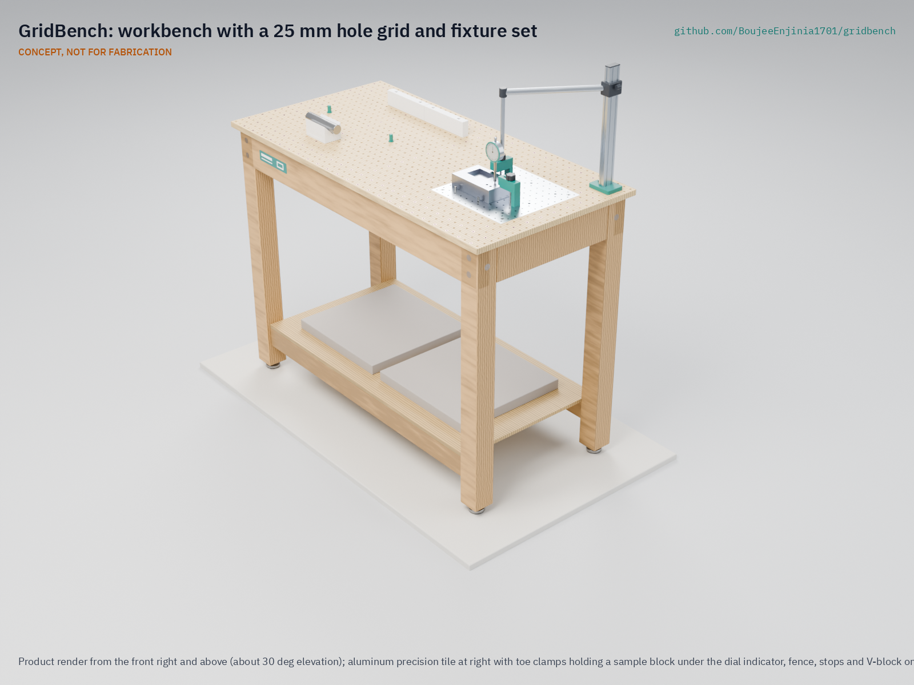

# GridBench

     

**Area:** Advanced Manufacturing · **TRL:** 3 of 9 (proof of concept on paper) · **Value-engineering target:** USD 250 (estimated cost of the constructable design USD 268.40; see Concept) · **Difficulty:** 2 of 5

A modular fixture and workbench standard: a 25 mm hole grid plate with printable and machined clamps, stops and jigs, so community workshops can hold, assemble and test parts repeatably.

[Exploded render](media/render-exploded.png) · [Detail render](media/render-detail.png) · [Interactive 3D model](media/viewer.html) · [Concept blueprint (PDF)](media/concept-blueprint.pdf) · [General arrangement GBN-DWG-001 (PDF)](cad/drawings/GBN-DWG-001.pdf) · [Calculations](docs/04-calcs/01-sizing.md) · [Prototype build plan](docs/05-build-plan.md) · [Design decisions](docs/06-design-decisions.md) · [Review note](docs/REVIEW.md)

## Concept rationale

A shared grid lets jigs designed for one project be reused in any workshop, which is the manufacturing counterpart of the lab's documentation kit, ReadyKit. GridBench adopts the 25 mm, M6 pattern of metric optical breadboards ([RP Photonics](https://www.rp-photonics.com/optical_breadboards.html)) rather than inventing a new one, so commercial accessories fit from day one, and splits the top into a cheap plywood field for area and a small aluminum tile for precision, so precision is paid for only where it is used.

Keeping it open and garage-buildable is the point: a fixture standard only helps if many benches share it. A timber frame, one sheet of plywood, one aluminum plate and printed clamps can be built with a drill press and taps, and each jig can be published as a build123d file that fits any GridBench.

## Burning platform

Most making happens in small firms. Small and medium enterprises are about 90 % of businesses and more than half of employment worldwide ([World Bank](https://www.worldbank.org/ext/en/topic/competitiveness/small-and-medium-enterprises-smes-finance)), and in the United States more than 98 % of the roughly 239,000 manufacturing firms counted in 2022 had fewer than 500 employees ([National Association of Manufacturers, Facts About Manufacturing](https://nam.org/mfgdata/facts-about-manufacturing-expanded/)). These firms rarely own modular fixture systems: a 1,200 x 800 mm fixture table from one leading system starts at about $2,561 before clamps ([Siegmund System 16 listing](https://weldingtablesandfixtures.com/products/4-161025-p-siegmund-1200x800mm-basic-system-16-welding-table)).

Demand for local, repeatable making is rising with repair. The world generated a record 62 million tonnes of e-waste in 2022 and only 22 % was formally recycled ([ITU and UNITAR, Global E-waste Monitor 2024](https://www.itu.int/hub/2024/04/the-world-generated-62-million-tonnes-of-electronic-waste-in-just-one-year-and-recycled-way-too-little-un-agencies-warn/)), and repair and remanufacture depend on holding parts accurately without factory tooling.

## Where it could be used

### By industry

| Industry | Use |
| --- | --- |
| Makerspaces and fab labs | Shared bench where members set up a published jig in minutes; the Fab Lab network alone has over 1,750 labs in 100 countries ([Fab Foundation](https://fabfoundation.org/about/)) |
| Electronics and appliance repair | Holding boards, housings and motors for disassembly, rework and testing with the indicator post |
| Small-batch manufacturing | Drilling, gluing and assembly jigs for runs of 10 to 500 parts |
| Technical education | Teaching datums, location and clamping on a bench students can build |
| Open hardware and research labs | Build and check fixtures shipped with designs; optics and sensor setups on the M6 grid |
| Furniture and joinery | Stops and fences for repeat cuts and drilling on the plywood field |

### By country or region

| Country or region | Why it matters there |
| --- | --- |
| European Union | The repair directive must apply in member states by 31 July 2026, requiring producers to offer repair and spare parts ([European Commission](https://commission.europa.eu/law/law-topic/consumer-protection-law/directive-repair-goods_en)); independent repairers need low-cost, repeatable workholding. |
| United States | More than 98 % of manufacturing firms had fewer than 500 employees in 2022, and about three quarters had fewer than 20 ([National Association of Manufacturers](https://nam.org/mfgdata/facts-about-manufacturing-expanded/)); makerspaces and job shops can share jigs as files. |
| India | MSMEs account for 30.1 % of GDP and 35.4 % of manufacturing ([Press Information Bureau, 2025](https://www.pib.gov.in/PressReleasePage.aspx?PRID=2142170&reg=48&lang=2)); consistent quality helps small units supply larger buyers. |
| Ghana | Suame Magazine in Kumasi, an artisan engineering cluster, had over 80,000 people working in it by 2018 ([Adu-Gyamfi and Adjei, AfricaLics working paper](https://openair.africa/wp-content/uploads/2018/09/WP-16.pdf)); shared jigs could make artisan-made parts interchangeable. |
| Kenya | Informal sector employment grew 4.5 % in 2023, faster than formal wage employment at 4.1 % ([Kenya National Bureau of Statistics, Economic Survey 2024, popular version](https://www.knbs.or.ke/wp-content/uploads/2024/05/2024-Economic-Survey-Popular-Version.pdf)); jua kali workshops make parts with hand tools and could build the bench locally. |

## What sparked the idea

The idea traces back to Paris in 1785, when Thomas Jefferson, then the US minister to France, was shown the work of the gunsmith Honoré Blanc. Jefferson wrote to John Jay that he was handed the parts of 50 musket locks sorted into compartments, put several locks together himself from parts picked at random, and found that they fitted perfectly ([Jefferson to Jay, 30 August 1785, Founders Online](https://founders.archives.gov/documents/Jefferson/01-08-02-0354)). Jefferson added that Blanc achieved this "by tools of his own contrivance," which also shortened the work, and that the advantages when arms need repair were evident (same letter). Repeatability came from purpose-made tooling rather than from a large factory, which is still the situation of a small workshop today. What such workshops lack is a common base on which those fixtures can be shared, and GridBench is an attempt to supply one.

## Problem

Repeatable building needs repeatable fixturing, and commercial modular fixture systems are costly while improvised jigs are one-off. Problem statement: [docs/01-problem.md](docs/01-problem.md).

## Concept

A 1,200 x 600 mm workbench with a 25 mm, M6 hole grid: a plywood field with tee nuts and threaded inserts for general holding, a flush 300 x 300 mm aluminum precision tile with dowel bores for repeatable location, printed clamps, stops and V-blocks, and an instrument post with a user-supplied dial indicator to check parts in place. Two concrete slabs on the shelf keep it from tipping and rubber-padded feet keep it from sliding. The TRL 3 calculations ([GBN-CAL-001](docs/04-calcs/01-sizing.md)) find 7 of 12 requirements met on paper or by design. Value-engineering target: USD 250; estimated cost of the constructable design: USD 268.40 (USD 18.40 over the target). Clamp hold-down is met at the tee-nut positions and on the tile but not at the 122 screw-in insert positions over the frame; a light-duty rating for those is proposed, awaiting Amish. The recommendations Amish accepted on 2026-09-25 are recorded in [GBN-DDR-002](docs/decisions/0002-recommendations-accepted.md), and the changes that make the design buildable in [GBN-DDR-003](docs/decisions/0003-design-for-construction.md).

Full design precis: [docs/02-concept.md](docs/02-concept.md) · Requirements: [docs/03-requirements.md](docs/03-requirements.md) · Decisions: [DDR-001](docs/decisions/0001-trl2-review-decisions.md), [DDR-002](docs/decisions/0002-recommendations-accepted.md), [DDR-003](docs/decisions/0003-design-for-construction.md), [register](docs/06-design-decisions.md) · Model: [cad/src/model.py](cad/src/model.py)

## Key components

- Bolted timber bench frame (M8 bolts and cross dowels) with 45 x 120 mm aprons, rubber-padded levelling feet and a lower shelf
- 18 mm plywood grid worktop, 25 mm pitch, M6 flanged tee nuts (screw-in inserts over the frame) on a 50 mm sub-grid
- Aluminum precision tile, 300 x 300 mm, 144 M6 holes and 9 dowel bores 8 mm H7
- Hardened 8 mm locating pins, one round and one diamond per precision fixture
- Printable clamp, stop, fence and V-block library (every part fits a 200 x 200 mm print bed)
- Instrument post for a 0.01 mm dial indicator (user-supplied)
- Two concrete ballast slabs on the shelf; optional wall anchor brackets

The priced bill of materials (17 lines) is in [bom/bom.csv](bom/bom.csv).

## Building the prototype

The [prototype build plan](docs/05-build-plan.md) (GBN-BLD-001) shows how to make each of the 20 components and put the bench together in 15 steps, with a making sketch for every made part and a picture for every joint and step, all drawn from the model. The frame is sawn and drilled softwood joined with M8 bolts and cross dowels, the worktop is drilled plywood, the tile is drilled, reamed and tapped aluminium plate, and the fixtures are printed in PETG on a 200 x 200 mm bed. Making the design buildable changed some details of the concept, recorded in [GBN-DDR-003](docs/decisions/0003-design-for-construction.md); decisions still open are in the [design decisions register](docs/06-design-decisions.md). It is a plan: nothing has been built yet.

## Safety

> Drilling, tapping and clamping create chip, projectile and pinch hazards: wear eye protection and secure work before cutting. The empty bench tips at about 117 N at the top edge (estimate); place both ballast slabs on the shelf or anchor it to a wall before use. Printed clamps can crack under overload; respect the rated screw torque of 1.6 N·m. Not for welding or hot work.

## Repository layout

| Folder | Contents |
| --- | --- |
| `docs/` | Problem, concept, requirements, calculations and design decisions |
| `cad/src/` | build123d Python source, the source of truth for all geometry |
| `cad/step/`, `cad/stl/` | Exported models for FreeCAD, other CAD tools and printing |
| `cad/drawings/` | 2D sketches and dimensioned drawings |
| `bom/` | Bill of materials |
| `electronics/` | KiCad schematics and PCB layouts |
| `firmware/` | Microcontroller code |
| `media/` | Renders, perspectives and photos |
| `build-log/` | Dated prototyping notes |

## Documentation

Controlled documents follow the portfolio [documentation standard](.kit/STANDARDS.md). Each carries a document ID (GBN-PRC-001 for the precis), a version and a revision history. Branded PDFs are built with `python .kit/render.py` and attached to GitHub Releases when a document is tagged, for example `GBN-PRC-001/v1.0`.

## Credits

Designed by Amish Chadha. See [CONTRIBUTORS.md](CONTRIBUTORS.md) for roles. To cite this design, use [CITATION.cff](CITATION.cff) (GitHub shows it as "Cite this repository").

AI assistance (Claude) was used to accelerate concept renders, prototype documentation and first-pass sizing calculations. Design direction and all decisions are Amish Chadha's, recorded in this repository's decision records (`docs/decisions/`).

## Licenses

- **Hardware** (CAD, drawings, BOM, electronics): [CERN-OHL-S v2](LICENSE)
- **Software** (firmware, scripts, notebooks): [MIT](LICENSE-SOFTWARE)

A project of the [Design Molecule](https://designmolecule.com) lab.
