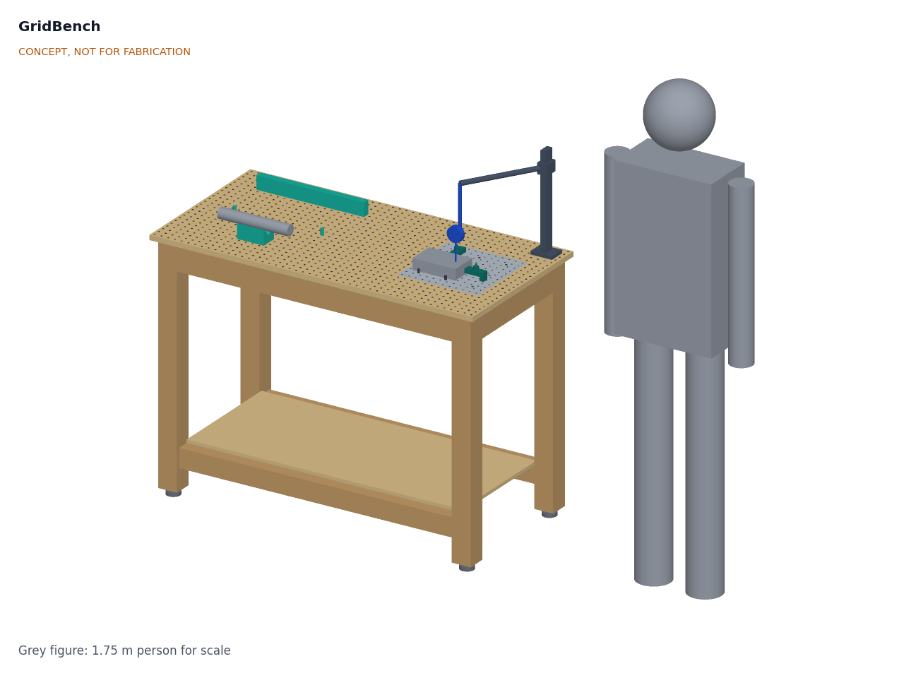
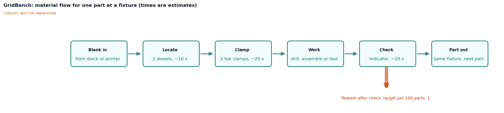
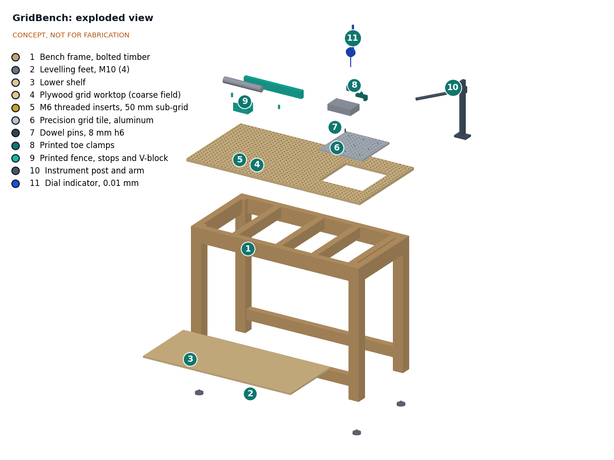

# GridBench design precis

## Summary

GridBench is a 1,200 x 600 mm workbench whose top is a 25 mm hole grid with M6 threads, the same pattern as metric optical breadboards. A cheap plywood field covers most of the top for general holding, and a 300 x 300 mm aluminum precision tile, set flush on the same grid, carries work that must repeat to a few hundredths of a millimeter. Printed clamps, stops, fences and V-blocks bolt to either zone, and a post with a dial indicator checks parts in place. The parts are estimated at about $239, above the $220 budget (see Cost).

Figure 1. GridBench concept with a 1.75 m person for scale. Concept, not for fabrication.

## How it works

1. **One grid everywhere.** Hole centers sit at 12.5 + 25k mm from the front-left corner of the worktop, in both directions. The tile's holes continue the plywood grid, so a fixture can straddle both zones and any fixture file places itself by grid coordinates (column, row).
2. **Locate on dowels, clamp on threads.** As on machinist fixture plates, location and clamping are separate. On the tile, nine reamed 8 mm H7 bores at 100 mm pitch sit in the centers of grid squares, between the M6 holes. A fixture or part nest carries two pressed 8 mm h6 dowel pins that drop into two bores, then M6 screws clamp it down. On the plywood field, 6.6 mm plain holes take stop pins, and M6 threaded inserts on a 50 mm sub-grid take clamps.
3. **Work and check in the same setup.** The instrument post bolts to any grid hole and carries a dial indicator on an arm, so a part can be checked before it is unclamped (Figure 3).

Figure 3. Material flow for one part at a fixture. Times and the rework rate are estimates or targets.
4. **Fixtures travel as files.** Each fixture is a parametric build123d part that states its grid footprint. A workshop that builds a GridBench can print or machine a published jig and expect it to fit. Jigs documented with the lab's ReadyKit toolchain can carry their own drawings and revision history.

Figure 2. Exploded view. Callout numbers match the lines in `bom/bom.csv`.

## Main components

Table 1. Main components (numbers match the BOM and Figure 2).

| No. | Component | Concept |
| --- | --- | --- |
| 1 | Bench frame | Bolted softwood: four 70 x 70 mm legs, 45 x 95 mm aprons, four 45 x 70 mm cross rails at no more than 300 mm spacing, low rails for the shelf |
| 2 | Levelling feet | Four M10 feet in T-nuts, ±15 mm adjustment |
| 3 | Lower shelf | 12 mm plywood, also the place for ballast (see R12) |
| 4 | Plywood grid worktop | 18 mm birch plywood, 1,200 x 600 mm, 1,008 holes on the 25 mm grid, 300 x 300 mm pocket for the tile |
| 5 | M6 threaded inserts | 252 screw-in inserts on the 50 mm sub-grid of the plywood field |
| 6 | Precision grid tile | 6061 or cast aluminum tooling plate, 300 x 300 x 12.7 mm, 144 M6 tapped holes and 9 reamed 8 mm H7 dowel bores, flush with the worktop and bolted to two cross rails |
| 7 | Dowel pins | 8 mm h6 hardened pins, 20 mm long |
| 8 | Printed toe clamps | PETG, M6 screw, heel on the grid; four per set |
| 9 | Printed fence, stops and V-block | Fence on two grid holes, stop pins for 6.6 mm holes, 90° V-block for round parts |
| 10 | Instrument post and arm | 20 x 40 mm aluminum extrusion on a grid foot, 10 mm steel arm |
| 11 | Dial indicator | 0.01 mm resolution, 10 mm travel, 8 mm stem |
| 12 | M6 fastener kit | Cap screws, washers and printed knobs (no callout) |

## First-order numbers

All values are estimates for concept communication and will be checked by calculation at TRL 3.

Table 2. First-order numbers.

| Quantity | Estimate | Assumptions |
| --- | --- | --- |
| Grid positions | 1,152 (48 x 24): 144 on the tile, 252 inserts and 756 plain holes on the plywood | 25 mm pitch, 12.5 mm edge offset |
| Bench mass | About 40 kg (frame about 22 kg, worktop about 8 kg, tile about 3 kg, shelf about 4 kg, rest about 3 kg) | Softwood 500 kg/m³, plywood 680 kg/m³, aluminum 2,700 kg/m³ |
| Worktop deflection, 500 N at bay center | About 0.3 to 0.4 mm | Simply supported strip 200 mm wide over a 300 mm span, E about 7 GPa |
| Tipping force at the top edge | About 105 N empty; about 160 N with 20 kg on the shelf | Feet 245 mm from the center line, push at 900 mm |
| Tile thermal growth | About 0.07 mm over 300 mm per 10 K | Aluminum, 23 x 10⁻⁶ /K |
| Plywood field moisture movement | Up to about 0.4 mm over 1,200 mm for a 5 % moisture swing | In-plane movement about 0.007 % per 1 % moisture content (estimate, source to be confirmed) |
| Dowel relocation | 0 to 0.024 mm diametral clearance, so about 0.03 mm repeatability | 8 mm h6 pin in an H7 bore |
| Clamp force at the part | About 0.8 kN at 2 N·m screw torque | M6, nut factor 0.2, toe clamp with the screw at mid-length |
| Tapping the tile by hand | About 2.5 h for 144 holes | About 1 min per hole with a tapping guide |

## Key design choices

All choices are **Proposed, awaiting Amish**.

1. **Grid: 25 mm, M6.** Matches metric optical breadboards, so commercial posts, clamps and bases fit ([RP Photonics, "Optical breadboards"](https://www.rp-photonics.com/optical_breadboards.html)). Alternatives: 50 mm with M8 or 16 mm bores (closer to welding tables, coarser), or 32 mm (cabinet-making). Recommendation: 25 mm, M6.
2. **Two zones instead of one precise top.** A full aluminum top of 1,200 x 600 mm would cost several times the budget. Plywood gives area; the tile gives precision where it is needed. Alternative: an all-plywood top with inserts at every hole (about $115 of inserts, no precision zone). Recommendation: two zones.
3. **Inserts on a 50 mm sub-grid.** Inserts at every plywood hole would add about $75 and a day of fitting. Clamps rarely need a thread at every 25 mm. Recommendation: 50 mm sub-grid, with the 25 mm holes kept for pins.
4. **Bolted timber frame rather than welded steel.** Timber needs no welder and suits the garage-build rule; steel is stiffer and more compact. Recommendation: timber for the prototype, steel as a documented variant.
5. **PETG printed fixtures with steel where it matters.** Dowels, screws and the tile are metal; bodies are printed. Alternative: all-machined fixtures (stronger, much costlier). Recommendation: printed bodies, with a machined option for heavily used jigs.
6. **Tile position at the right of the worktop,** leaving the left 800 mm free for large parts. Recommendation as modeled; a second tile position could be added later.

## Cost

The indicative parts cost is about $239 (`bom/bom.csv`), about 9 % over the $220 budget. The largest items are the aluminum tile with its taps and reamer (about $50), the plywood worktop (about $45) and the frame (about $38). Options to close the gap, **Proposed, awaiting Amish**:

- (a) Treat the dial indicator as user-supplied (most workshops own one): about $224.
- (b) Also buy tile stock as offcut instead of cut-to-size plate: about $214 (price unverified).
- (c) Raise `budget_usd` to $250. `project.yaml` is unchanged.

Recommendation: (a) plus (b), with (c) as the fallback if offcut prices do not hold.

## Safety

> **Safety:** Drilling, tapping and routing the worktop and tile create chips and projectiles: wear eye protection and clamp work before cutting. Clamps and toe clamps create pinch points; keep fingers clear when tightening. The empty bench tips at about 105 N at the top edge (estimate), so ballast the shelf or anchor the bench to a wall before use. Chamfer or round all plywood, tile and printed edges. Printed clamps can crack and release a part under load; do not exceed the rated screw torque and do not use printed clamps for machining with a milling machine. The bench is not for welding, grinding sparks or hot work: plywood and PETG are combustible.

## Open questions

- [ ] Grid choice (25 mm, M6) and whether a heavy 50 mm variant belongs in the standard. Proposed, awaiting Amish.
- [ ] How fixtures declare their footprint and datum in files, so that a published jig places itself on any bench. Proposed: a short fixture metadata block in each build123d file, awaiting Amish.
- [ ] Can the tile be drilled accurately enough (±0.05 mm) without CNC, using a printed or steel drill jig on a drill press? To be checked at TRL 3.
- [ ] Plywood moisture movement: find a sourced figure and decide whether the plywood field needs sealing or a shorter span.
- [ ] Insert pull-out strength in birch plywood (estimate 2 to 4 kN per M6 insert, unverified).
- [ ] License for the fixture library: CERN-OHL-S-2.0 as for all hardware here, or a permissive license to help commercial jig makers adopt the grid. Proposed, awaiting Amish.
